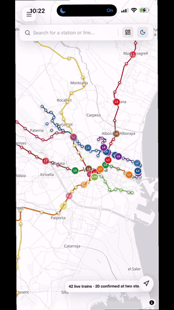

<p align="center">
  
</p>

<h1 align="center">vibe_VLCmetroMap</h1>

<p align="center">
  Where every train on the Valencia metro is, right now — and when the next one reaches you.
</p>

<p align="center">
  <a href="https://tangerine-panda-1aeea5.netlify.app"><strong>Open the live map →</strong></a>
</p>

---

Metrovalencia publishes when a train is <em>due</em> at a station. It does not publish where any train actually <em>is</em>. This app works that out: it takes the live arrival predictions, walks them backwards along the real rail geometry, and draws every train on the map at the position those predictions imply.

It runs as a website and as a native iOS app, from the same code.

## See it working

<p align="center">
  
</p>

<p align="center">
  <em>Recorded on an iPhone. <a href="docs/demo.mp4">Full-resolution video</a> (10 s, no audio).</em>
</p>

**What you are looking at**, in order:

1. **The whole network, live.** Every coloured dot on a line is a train the API is currently reporting, drawn at the position its arrival predictions imply rather than at a station. The counter at the bottom reads *"42 live trains · 20 confirmed at two stations"* — the second number is the trains sighted at two different stations at once, which pins them down far more tightly than a single prediction can.

2. **Zooming in.** Street names and building footprints stay sharp all the way down, because the basemap is vector and ships with the app. Nothing here is being fetched.

3. **Alameda, opened.** The bubble on the map shows the two directions with the next train each way; the panel below gives the detail — `5 → Aeroport · Marítim` and `3 → Rafelbunyol · Alboraia Peris Aragó · Torrent Avinguda +1`, then the individual trains with their unit numbers (#7033, #3040, #9033). `LIVE` and *"confirmed just now"* mean the API answered for this station moments ago.

4. **The countdown running.** Watch the top row go `<1 min` → **Due** while the recording plays. Those countdowns are absolute timestamps ticking down on the device, not repeated polling — which is why they stay correct between refreshes.

5. **Xàtiva, opened.** A different shape of station: both directions are line 9, and the arrows on the bubble point the way the track actually leaves the platform rather than simply up and down.

6. **Zooming back out** to the full network, north to Rafelbunyol and Puçol, south past Picassent.

## What you can do with it

**See the whole network moving.** Every train the API knows about, drawn on the actual track alignment rather than a schematic, easing between positions as the predictions update. Lines with no live data fall back to simulated trains — drawn hollow and dashed, so a guess never looks like a reported train.

**Tap a station for its departures.** The next train each way, prominently, then everything else due. Live where the API answered just now, and counting down from memory where it did not.

**Find your nearest station.** One press centres the map on you and opens the departures for the station you are closest to. Hold the same button to take your location back off the map. If the fix is too rough to tell two stations apart, it says so rather than guessing.

**Use it underground.** The basemap ships with the app — around 35 MB of vector tiles covering the whole Valencia region, read straight off disk. No network, no API key, and sharp all the way in to individual buildings.

**Leave it running as a departure board.** `?mode=dashboard` opens a full-screen board for an unattended tablet or a spare monitor. It is bookmarkable, so a kiosk can boot straight into it.

**Find things quickly.** Search any station or line, filter the map to a single line, and switch between a light and a dark map.

## What it is honest about

The app never pretends to know more than it does, and that is deliberate throughout:

- A train marker **fades as its position becomes a guess** — the longer the walk from a known prediction, and the longer since the last sync, the fainter it is drawn.
- A train that has run out of prediction entirely is fainter still, and separately so.
- A simulated train is **hollow and dashed**, never mistakable for a live one.
- Fourteen stations sit on branches the geometry does not have, so trains bound for them are **not drawn at all** rather than drawn in the wrong place ([#2](https://github.com/JieGH/vib_metroValencia/issues/2)).
- A location fix too imprecise to choose between neighbouring stations **refuses to choose**.

## Quick start

```bash
npm install
npm run fetch:basemap   # the offline map tiles — see Data pipeline
npm run dev             # http://localhost:5173
npm test
```

The app still runs without `fetch:basemap`; it falls back to online raster tiles that stop resolving past zoom 16.

## For the next person working on this

`CONTEXT.md` is the glossary — read it before naming anything. The decisions behind the design are in `docs/adr/`:

- [ADR-0001](docs/adr/0001-walk-the-timetable-to-place-trains.md) — why positions come from a timetable walk, not a speed constant
- [ADR-0002](docs/adr/0002-one-polyline-per-line-no-branches.md) — why branches are unsupported, and what that costs
- [ADR-0003](docs/adr/0003-gtfs-feeds-are-refetchable-input.md) — why feeds are fetched, not committed
- [ADR-0004](docs/adr/0004-geolocation-comes-from-the-capacitor-plugin.md) — why geolocation comes from the Capacitor plugin and never the browser

## Running the app

The same React app ships two ways: as a website, and as a native iOS app via [Capacitor](https://capacitorjs.com). Both build from the same `src/`; nothing in the app code branches on which one you're using except `arrivalStore.js`'s fetch, explained below.

### Web

```bash
npm run dev        # http://localhost:5173, hot-reloading
npm run dev:phone  # same, but bound to 0.0.0.0 — open the printed
                   # Network URL on a phone on the same Wi-Fi
npm run build      # production bundle → dist/
npm run preview    # serves dist/ as it would be deployed
```

`npm run dev` and `dev:phone` proxy `/api/metro/*` to the live arrivals API through Vite's dev server. This isn't optional plumbing — the API requires a `User-Agent` header containing `contact=`, which browser `fetch()` can never set (a forbidden header, by spec, in every browser). The proxy runs in Node, which has no such restriction, and injects it.

### Production deployment (Netlify)

The live site above runs on [Netlify](https://netlify.com), auto-rebuilding and republishing on every push to `main` — no manual deploy step. Netlify reads the build command and publish directory straight from [`netlify.toml`](netlify.toml); no dashboard configuration is needed beyond connecting the repo.

A static host has no dev server, so two things exist purely to cover what the dev proxy above did, and are easy to break by "cleaning up" without knowing why:

- **[`netlify/functions/metro-proxy.js`](netlify/functions/metro-proxy.js)** replaces the Vite dev proxy in production. A `netlify.toml` redirect looked like the obvious fix — Netlify's own docs describe custom headers on proxy redirects — but tested against the live deploy, Netlify's redirect proxy silently overwrites any custom `User-Agent` with the real visitor's, the same restriction Vercel's Edge runtime has (undocumented by Netlify). A Netlify Function instead does its own server-side `fetch()`, which carries no such restriction. Its `User-Agent` value must be kept in sync with `vite.config.js`'s dev proxy by hand — nothing enforces the two match.
- **`fetch:basemap` runs as part of the Netlify build command**, not just locally: the offline PMTiles archive is gitignored (see [Data pipeline](#data-pipeline)) and 404s in production without it. The `go-pmtiles` CLI it downloads publishes differently-named release assets per OS — hyphenated `.zip` on Darwin, underscored `.tar.gz` on Linux — so the script picks the filename and extraction method for whichever platform the build runs on, Netlify's Linux build image included.

Free-hosting options considered (GitHub Pages, Netlify, Vercel, Cloudflare Pages) and why Netlify won: [`docs/research/free-github-hosting.md`](docs/research/free-github-hosting.md).

### iOS (native app)

The native shell is a thin Capacitor wrapper: the same web build, running full-screen in a WKWebView, packaged as a real `.app`. No server, no Wi-Fi dependency for the UI — only the live arrivals need a network connection, same as the website.

**Prerequisites**

- A Mac with the full **Xcode** app installed (not just the Command Line Tools — `xcodebuild -version` should report a real version, not a CLT-only error)
- An Apple ID signed into Xcode (Xcode → Settings → Accounts). A free personal account is enough to run on your own device; it just needs re-installing from Xcode roughly every 7 days. A paid developer account removes that limit.
- An iPhone, connected by USB the first time

**Build and run**

```bash
npm install        # installs @capacitor/core, @capacitor/ios, @capacitor/cli
npm run ios:sync   # npm run build, then copies dist/ into ios/App/App/public
npm run ios:open   # opens ios/App/App.xcodeproj in Xcode
```

Then, in Xcode:

1. Select the **App** target → **Signing & Capabilities** → set **Team** to your Apple ID.
2. In the toolbar's device dropdown, choose your iPhone under **iOS Device** (not a simulator).
3. Press **Run** (▶ / Cmd-R).

First launch, iOS blocks the app as an "Untrusted Developer": on the phone, go to **Settings → General → VPN & Device Management** and trust the developer profile, then open the app from the home screen.

**After any code change**, re-run `npm run ios:sync` before hitting Run again in Xcode — it rebuilds the web bundle and re-copies it into the native project. Xcode doesn't watch `src/` itself.

Two things exist purely to make this build path work, and are easy to break by "cleaning up" without knowing why:

- **`capacitor.config.json`'s `plugins.CapacitorHttp.enabled`.** WKWebView's `fetch` is still browser `fetch` — it can't set `User-Agent` either. Enabling `CapacitorHttp` patches `fetch` to route through native networking instead, which isn't subject to that restriction. `arrivalStore.js` checks `Capacitor.isNativePlatform()` and only sends the header on that path; the web build keeps using the dev-server proxy above.
- **`public/vendor/maplibre/`.** MapLibre resolves its own web-worker URL from `import.meta.url`, which Vite's bundler never emits as an actual file — the map's lines and tiles render in `npm run dev` (Vite serves the real file from `node_modules` directly) but silently fail in any production build, native app included. These two files are an unmodified copy of MapLibre's worker and its shared chunk, kept as static assets so the path always resolves. If `maplibre-gl` is upgraded, re-copy both files from `node_modules/maplibre-gl/dist/`.

## How a train gets on the map

1. **Boot.** `arrivalStore.seedStrategicHubs()` fetches three interchange stations.
2. **Predictions land.** The API answers "vehicle 5301 reaches Àngel Guimerà in 415s", stamped with an absolute `trainTimestamp`. `arrivalStore` keeps these in memory and in `sessionStorage`.
3. **Positions are walked.** `trainPositionEngine` steps back along the line's station chain from the station a train is due at, spending each segment's real timetabled interval and dwelling at each platform, until the countdown is used up. Where the same vehicle is predicted at two stations, the nearest sighting anchors the walk and the pair settles the direction.
4. **The map animates.** `MapView` samples the engine each frame and eases each marker towards its new anchor.
5. **Network Sync.** Every two minutes the Major Stations are refetched, because predictions age out after ~18 minutes.

Lines with no live predictions fall back to simulated trains. They are drawn hollow and dashed — they are a headway guess, not a reported train, and must never look like one.

### Why some live trains look faint

A marker is drawn at the confidence its position actually carries. Two things blur it, and neither is the prediction's age on its own — `targetTimestamp` is absolute, so a prediction sitting in memory keeps counting down correctly and the walk gets *more* accurate as the train approaches. What blurs it is the length of the walk (the feed states every time to a whole minute, so each segment spent carries ±30s, accumulating as √n) and the time since the last sync (the train drifting from what the API predicted). Both convert to metres at the line's commercial speed, and 200 m to 1 km of uncertainty takes a marker from full strength down to 0.45.

A train that has run out of prediction — past its arrival time and past the dwell, dead-reckoning forward at timetable speed — sits below all of that, at 0.35. It gets a floor of its own because uncertainty is measured in metres and therefore scales with line speed: on line 1 at 11 m/s a full-length countdown alone is already 991 m of doubt, so without the separation a dead-reckoned train there would look identical to one that still has a prediction to spend. That state is not about age either — a prediction fetched a second ago can already be in it.

The drift half of that is the weakest number here. Nothing in this repo measures how far a train strays from what the API predicted; the rate is calibrated so two missed syncs cost about what a full-length countdown costs on a median line. [#4](https://github.com/JieGH/vib_metroValencia/issues/4) is the live watch that would replace it with a measurement.

### Why the walk, not a speed constant

The engine used to place a train by multiplying its countdown by one commercial speed. Real segments run from 3.9 m/s (Machado → Alboraia Palmaret) to 16.9 m/s (La Pobla de Farnals → Rafelbunyol), so no constant fits. Measured against live data — pairs where the API reported one vehicle at two stations, making the gap between timestamps ground truth — the walk cut mean timing error from 74s to 18s and mean position error from 534m to 130m, and was closer on 39 of 40 pairs.

The residual is dominated by the feed quantising every time to a whole minute. `Colón → Alameda` is timetabled at 60s and consistently runs ~100s.

## Data pipeline

The app imports three generated files. All are committed; the feeds they come from are not.

```bash
npm run fetch:gtfs     # download the current feed into a dated directory
npm run build:data     # regenerate gtfs_expanded.json + segment_times.json
npm run fetch:basemap  # the offline basemap: tiles, glyphs and sprites
npm test               # confirm the network still looks sane
```

- **`src/data/gtfs_expanded.json`** — every station with the lines it serves, plus line geometry.
- **`src/data/segment_times.json`** — median seconds between consecutive station arrivals, per line. ~440 segments, 12 KB. This is what the walk spends.
- **`src/data/metro_lines.json`** — the Track Geometry the engine projects onto. Simplified to 3 m tolerance by `npm run build:geometry` (5,747 → 988 points, 414 KB → 29 KB) because the engine imports it synchronously, so it ships in the JS chunk and has to be small. The script stamps the file and **refuses to run on an already-stamped one** — re-running would measure drift against its own output. To re-simplify: `git checkout src/data/metro_lines.json` first, then run it. Always follow with `npm test`: the track-geometry-fidelity tests fail if simplification drops a station out of a chain.
- **`public/line4_osm.geojson`** — line 4's finer OSM alignment, `fetch`ed at runtime rather than imported, so it was never in the bundle. It must live in `public/`: served from `src/` it resolved in dev and 404'd in production, where the failure was swallowed and line 4 quietly fell back to the coarser `metro_lines.json` alignment.
- **`line4_osm_raw_overpass.json`** (repo root) — the raw Overpass dump that `npm run build:line4` converts into the file above. Committed rather than gitignored, which [ADR-0003](docs/adr/0003-gtfs-feeds-are-refetchable-input.md) would otherwise argue against, because it is **not** currently refetchable: `scripts/fetch_line4_overpass.cjs` needs `node-fetch` and `osmtogeojson`, and neither is a dependency. Gitignore it once that script can actually run.
- **`public/basemap/`** — the offline basemap, ~35 MB, **gitignored**: a PMTiles extract of the Valencia region from [Protomaps](https://protomaps.com), plus the glyphs and sprites its style needs. Vector rather than raster, because every keyless raster provider stops having real tiles around zoom 16 — Esri's Gray Canvas serves a "map data not yet available" placeholder above it, and CARTO's keyless tiles come back stamped "API KEY REQUIRED". Vector has no such ceiling: the archive stops at zoom 15 and MapLibre draws it sharp at 20, because it is rendering geometry rather than stretching pixels. It is also genuinely offline — read straight off disk in the native app, and by HTTP range request on the web, so a visitor pulls the handful of tiles they look at rather than all 34 MB. Refetchable input rather than committed data, on [ADR-0003](docs/adr/0003-gtfs-feeds-are-refetchable-input.md)'s reasoning: 34 MB of binary has no business in git history. **The app falls back to online raster tiles when it is absent**, so a fresh clone still shows a map — just one that stops resolving past zoom 16.
- **`docs/demo.gif` and `docs/demo.mp4`** — the recording at the top of this file, both derived from one screen capture off a phone. Committed rather than gitignored because a README that renders nothing is worse than 3 MB of history, but kept deliberately small: the original was a 30 MB, 1080×1920, 60 fps HEVC file, which is both larger than the rest of the repository put together and unplayable outside Safari. To replace them from a new recording:

  ```bash
  ffmpeg -i recording.MP4 -an -vf "scale=540:-2,fps=30" -c:v libx264 -profile:v main \
         -pix_fmt yuv420p -crf 28 -movflags +faststart docs/demo.mp4
  ffmpeg -ss 0.5 -t 10 -i recording.MP4 -vf "fps=10,scale=288:-1:flags=lanczos,palettegen=stats_mode=diff:max_colors=128" pal.png
  ffmpeg -ss 0.5 -t 10 -i recording.MP4 -i pal.png \
         -lavfi "fps=10,scale=288:-1:flags=lanczos[x];[x][1:v]paletteuse=dither=bayer:bayer_scale=5" docs/demo.gif
  ```

  The GIF is what the README shows, because GitHub strips a `<video>` tag pointing at a path inside the repository but renders an animated GIF inline. The MP4 is linked beside it for anyone who wants it at full size.
- **`src/data/network_overlay.json`** — corrections applied on top of the feed. **Empty is the healthy state.** It exists because the feed bundled in July 2026 had already expired and predated lines 5 and 7 returning east of Alameda, while the live API was reporting trains bound for Marítim. A fresh feed made the overlay redundant; its `history` records why it existed.

**Refetch the feed when positions look wrong.** A GTFS feed carries a service calendar that expires, and a lapsed feed yields a timetable with no trips for today. The scripts always take the newest dated directory.

## Known limits

- **Branches.** A line is modelled as one polyline with a scalar distance along it, which cannot represent a fork. Lines 5 and 7 run north to Machado, line 1 to Torrent Avinguda, and line 8 through the line 6 corridor, but none of those branches are in `metro_lines.json`. Stations more than 250 m off their line's geometry are held out of its chain and listed in `trainPositionEngine.offTrackStations` — better an honest gap than a train drawn on the wrong track.
- **Station ids.** The GTFS `stop_id` space and the live API's id space disagree for most stations; `/api/metro/prevision/<id>` uses the API's. Never hand-write one — derive it from `paradas_api.json`. A wrong id fails silently, and `npm test` guards the ones we hardcode.
- **The eastern stations have no arrival endpoint.** Ayora, Amistat and Aragó carry trains and appear in search, but the API exposes no station id for them, so they have no arrivals card of their own.
- **Markers sometimes never appear in `npm run dev`.** A `StrictMode` double-mount races MapLibre's `style.load` over shared marker refs, so the map can load with no stations and no trains at all. It looks exactly like broken data and it is not — it does not happen in a production build. Reload, or see [#8](https://github.com/JieGH/vib_metroValencia/issues/8). Check `vite preview` before believing a rendering bug is real.

## Data, privacy, and trademarks

**This is an independent project, not an official one.** "Metrovalencia" is the trading name of [Ferrocarrils de la Generalitat Valenciana (FGV)](https://www.fgv.es), the public operator of the network, and its brand, colours and station names remain FGV's. This app is not built, run, reviewed, or endorsed by FGV — it is a third party reading their public feed and drawing what it says.

**What data the app touches, and where it goes:**

- **The GTFS schedule** ([`google_transit_feed`](https://www.metrovalencia.es/google_transit_feed/google_transit.zip)) is fetched by a build script (`npm run fetch:gtfs`), never at runtime by a visitor's device. It becomes the small, committed JSON files described above.
- **Live arrival predictions** are fetched from [metroapi.alexbadi.es](https://metroapi.alexbadi.es), a third-party API that itself reads FGV's live feed — this project did not build it and cannot vouch for its uptime or accuracy, only for what it does with what comes back.
- **Track geometry** comes from [OpenStreetMap](https://www.openstreetmap.org/copyright) contributors, via the Overpass API.
- **The offline basemap** is a [Protomaps](https://protomaps.com) extract, itself built from OpenStreetMap.

**What never leaves your device:**

- **Your location.** The locate feature reads a GPS fix from the OS and compares it, on-device, against the station list already in memory. It is never sent to this project, to FGV, to the arrivals API, or to any other service — there is no server that could receive it.
- **Everything you do in the app.** There is no analytics, no tracking pixel, no crash reporter, no account, and nothing about you is collected. The only thing the app writes down is a short-lived cache of recent arrival predictions, kept in the browser's `sessionStorage` so a repeat visit doesn't need to refetch — cleared automatically when the tab closes, and never sent anywhere itself.

**License.** The code in this repository is [Apache 2.0](LICENSE). That covers this project's code — not FGV's data, not OpenStreetMap's, and not Metrovalencia's brand, each of which carries its own terms.

**Thanks** to FGV for publishing the GTFS feed this runs on, to the maintainer of metroapi.alexbadi.es for the live arrivals API, to OpenStreetMap's contributors for the geometry, and to Protomaps for making an offline-first basemap possible without a tile-server bill.
